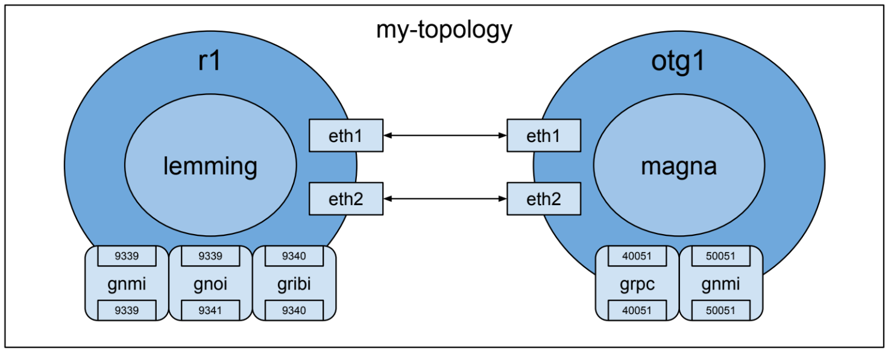

# Kubernetes Reference

## Kubernetes Introduction

**Kubernetes (k8s)** is an "open source platform for managing containerized
workloads and services". Basically it is a tool that allows us to manage
containers and the connections between them. It also allows us to expose
services from the containers. Overall k8s is a great tool for creating network
topology emulations.

The full documentation for k8s concepts can be found at
https://kubernetes.io/docs/concepts/. Below is a very basic summary of the major
k8s concepts specific to KNE.

### Container

A **container** is an application that is decoupled from the underlying host
infrastructure. Multiple containers can run on a single host and share
resources, without needing to allocate completely separate operating systems
like with virtual machines (VM). Overall, containers are more portable between
hosts in comparison to traditional VMs.

A **container image** is a ready-to-run software package containing everything
needed to run an application: the code and any runtime it requires, application
and system libraries, and default values for any essential settings. In k8s, a
container image is used to create a container.

### Pod

A **pod** is the smallest deployable unit in k8s. A pod is a group of one or
more containers with shared storage and network resources.

### Deployment

A k8s **deployment** manages a set of 1 or more replicated pods: ensuring the
all pods are healthy and in the desired state.

### Service

A k8s **service** exposes a network application that is running as one or more
pods in your cluster. This allows clients (both internal and external) to use
applications running in the cluster.

### ConfigMap

A k8s **ConfigMap** is an API object used to store non-confidential data in
key-value pairs. Pods can consume ConfigMaps as environment variables,
command-line arguments, or as configuration files in a volume.

### Namespace

A k8s **namespace** is a mechanism for isolating groups of resources within a
single cluster. Pods, services, etc. are created in a particular namespace.

### Cluster

A k8s **cluster** is an environment in which your containers, services, etc.
run. A cluster is made up of one of more nodes. Each **node** is usually either
a virtual or physical machine. K8s is so easy to scale because of this concept.
A cluster can be started with only a single node and more nodes can be added
later when your container deployments grow in number and size.

## KNE Glossary

Now that we have done over some of the basic k8s concepts, let's explore how KNE
utilizes each one.

### Cluster Deployment

The first step for creating a KNE topology is to run `kne deploy`. This command
is used to create your k8s cluster. A cluster is required to creates pods,
services, and any of the other k8s resources. KNE supports several options for
cluster creation, but regardless of which is chosen a k8s cluster will be
created ready for topology creation. Currently, the most used cluster tool in
KNE is **kind**. This tool actually hosts a single node k8s cluster inside of a
docker container. The details here are not important for the purpose of this
reference, but if you see the term *kind* then know it may be referring to a
tool for creating a k8s cluster. You can also bring your own cluster for use
with KNE, this is convenient for users with custom k8s setups.

NOTE: *kind* is also a field in kubeyaml used to specify resource type, you may
see this inside of k8s manifests. However when we refer to *kind*, it's likely
the cluster tool.

After the cluster is created, several k8s deployments are created to initialize
the cluster for use with KNE. This includes a service load balancer
implementation, a container network interface (CNI) implementation, and several
vendor controllers. These are outside the scope of this document and can largely
be ignored when you are getting started with KNE.

### Topology Creation

Now that we have a cluster, the next step is to run `kne create`. This command
creates a topology inside the k8s cluster. A topology is specified from a
textproto defined by:

```
message Topology {
  string name = 1;          // Name of the topology.
  repeated Node nodes = 2;  // List of nodes in the topology.
  repeated Link links = 3;  // Connections between nodes.
}
```

WARNING: Node is an overloaded term between k8s and KNE. The vast majority of
the time `node` will refer to a KNE node, an entity in the topology. However
note that `node` in k8s refers to a worker that makes up a k8s cluster.

Let's consider the example topology below:

```
name: "my-topology"
nodes: {
  name: "r1"
  vendor: OPENCONFIG
  model: "LEMMING"
  config: {
    image: "lemming:latest"
  }
  services: {
    key: 9339
    value: {
      name: "gnmi"
      inside: 9339
    }
  }
  services: {
    key: 9341
    value: {
      name: "gnoi"
      inside: 9339
    }
  }
  services: {
    key: 9340
    value: {
      name: "gribi"
      inside: 9340
    }
  }
}
nodes: {
  name: "otg1"
  vendor: OPENCONFIG
  model: "MAGNA"
  config: {
    image: "magna:latest"
  }
  services: {
    key: 40051
    value: {
      name: "grpc"
      inside: 40051
    }
  }
  services: {
    key: 50051
    value: {
      name: "gnmi"
      inside: 50051
    }
  }
}
links: {
  a_node: "r1"
  a_int: "eth1"
  z_node: "otg1"
  z_int: "eth1"
}
links: {
  a_node: "r1"
  a_int: "eth2"
  z_node: "otg1"
  z_int: "eth2"
}
```

In this case we are specifying a two node topology with two links seen below:



-   `my-topology` is the **namespace** representing our topology
-   `r1` and `otg1` are 2 separate **pods** in the namespace
-   `lemming` and `magna` are **containers** created from the **container
    images** `lemming:latest` and `magna:latest` respectively
-   `eth1` and `eth2` are networking resources shared by containers in a single
    pod
    -   `eth1` from pod `r1` is connected to `eth1` from pod `otg1`
    -   `eth2` from pod `r1` is connected to `eth2` from pod `otg1`
-   `grpc`, `gnmi`, `gnoi`, and `gribi` are **services** in their respective
    pods
    -   note that the outside and inside ports can be different, i.e. what is
        exposed externally via a load balancer and internally via a shared port
        assigned to the pod
